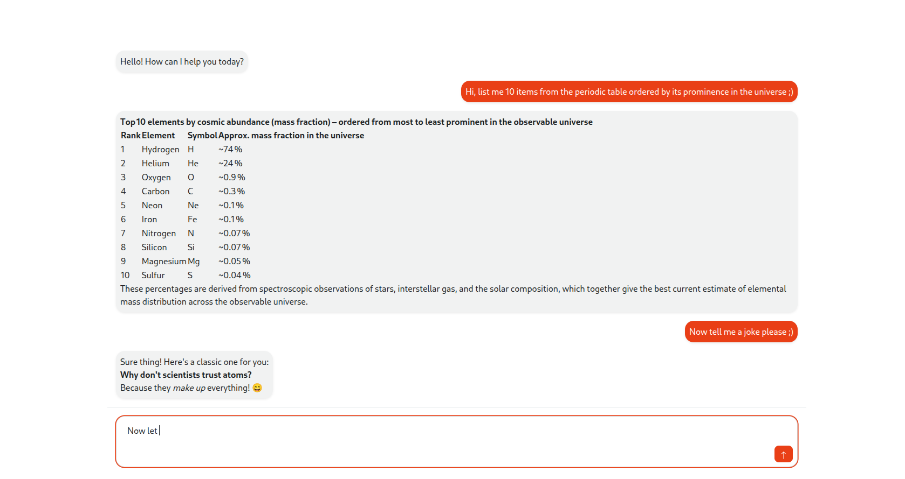

# Simple demo app for chatting with a cloud-model 

- llm_chat_client: Angular/nodejs chat client
- llm_microservice: Spring Boot microservice which asks the Ollama cloud-model "gpt-oss:120b" user questions and provides the client with the answers. Since an answer might be long, answers are given as streams
- To run the microservice, one needs to register at ollama.com (which is free) and get an API_KEY and provide this key as an environment variable, details follow ... 
- Short description of how it works: 1) Client asks a question by making a request to the microservice 2) The microservice asks the cloud model that question via another request and gets then back a stream which is then provided using SSEs to the client 3) The client displays the answer
- The demo is not production ready! See below.

TODOs:
- Write tests
- Let user choose between all the cloud-models
- Add more MCP functionality, at this moment, the model has no knowledge of the questions asked before, more context
- Make view look nicer
- Save conversations as it fits your use case and with the appropriate security considerations!
- IMPORTANT: Add security as it is appropriate for your usecase, at the moment only the communication of the microservice with the cloud has a respectable security: it uses both JWT and TLS. The communication between the frontend and the service is not secure at the moment, the only thing that is installed is CORS handling ;)
- Do things like caching, preprocessing, postprocessing, ...
- Complete this page

